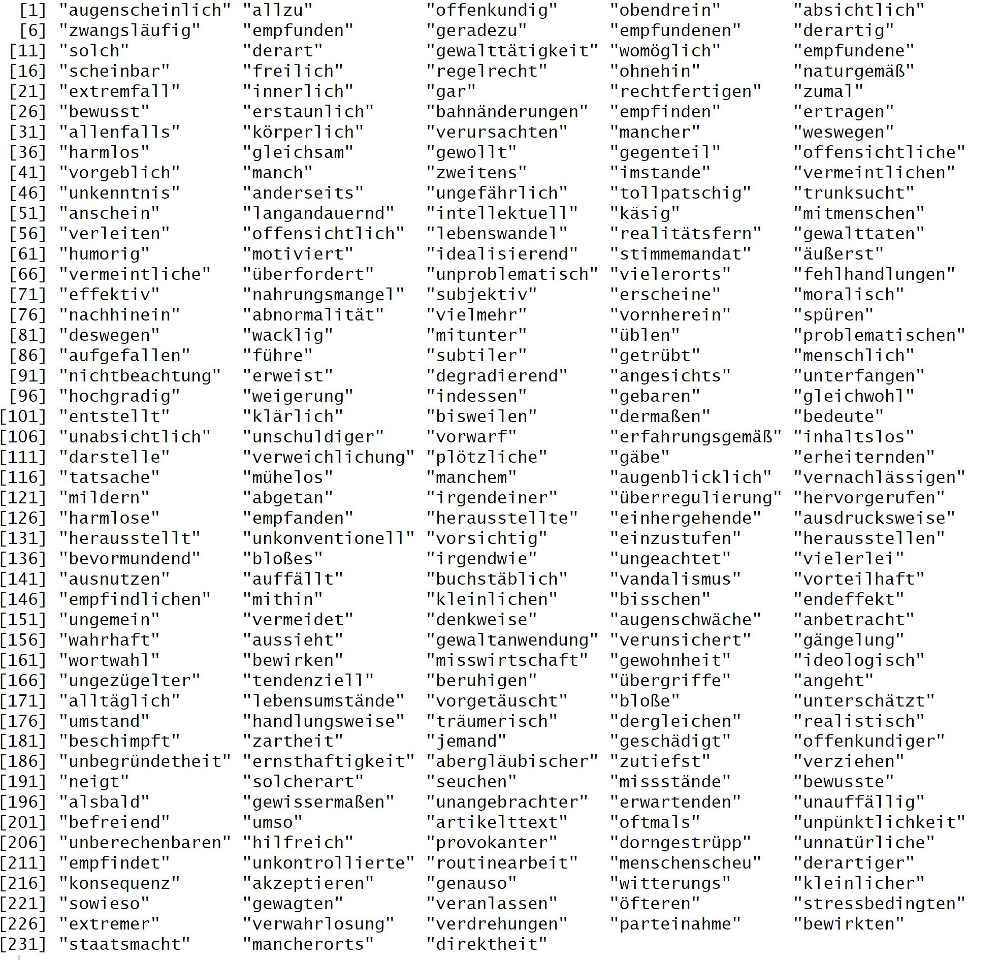
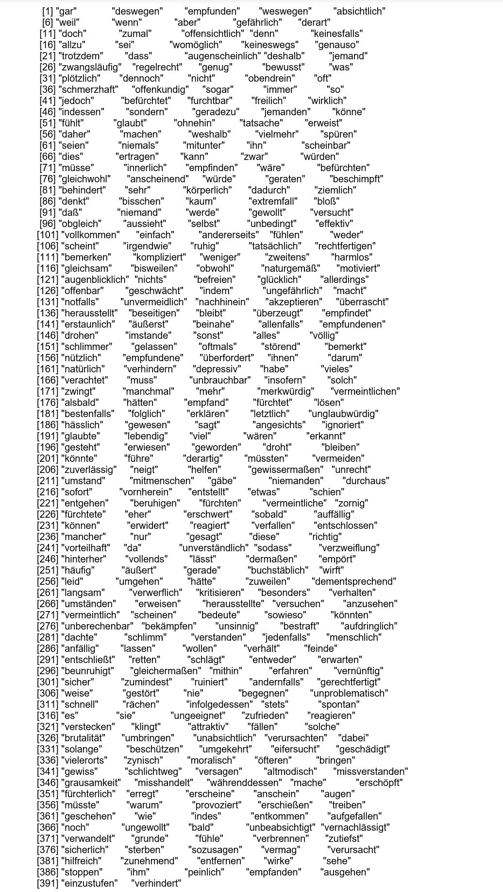

# Bad news are good news!? - Quantitative Text Analysis of German News Headlines

## Introduction

The world has faced multiple crises in the last decade, including the migration crisis starting in 2015, the Covid-19 pandemic, and the Ukraine War. Hence, there is a large amount of negative news in terms of its content. Besides, due to the growth in user-tracking technologies throughout the 2010s to measure content reach, it has become a common fact that ``Bad news are good news``, which means that negative headlines reach more clicks/ attention. Therefore, in this project we analyse folowing question: 

                  Have outlets started to drift towards increasing usage of negative sentiment in their headlines to make even good/ neutral news (in terms of its content) sentimentally more negative?

In order to find answers to this question, we applied several quantitative text analysis approaches, which is represented in following figure: 


***

## Data
### Collecting Data
For our analysis, we collected in total 548,629 ${\color{violet} 548,629 \space German \space news \space headlines}$ over a ``10-year time frame`` (01.01.2013 to 30.04.2023) from ``8 different news outlets`` and ``8 different categories``:


We used [MediaCloud.org](https://search.mediacloud.org/search?) to collect the headlines for the outlets **bild.de** and **Spiegel**. Due to the fact that Mediacloud API has an API request/rate limit, we downloaded the headlines as csv file manually from their webside. Headlines for the other **outlets** are not available on MediaCloud and therefore we scraped them directly from the outlets archive websides using [WebScraper.io](https://webscraper.io/) (Google Chrome Extension). In the following a sample SiteMap for scraping the headlines for the outlet **SZ** in category **Digitalisierung** is shown:

```markdown
{"_id":"DigitalisierungSueddeutsche","startUrl":["https://www.sueddeutsche.de/news/page/[1-97]?search=Digitalisierung&sort=date&all%5B%5D=dep&typ%5B%5D=article&sys%5B%5D=sz&catsz%5B%5D=alles&time=2013-01-01T00%3A00%2F2013-06-19T23%3A59&startDate=01.01.2013&endDate=31.12.2018","https://www.sueddeutsche.de/news/page/[1-97]?search=Digitalisierung&sort=date&all%5B%5D=dep&typ%5B%5D=article&sys%5B%5D=sz&catsz%5B%5D=alles&time=2013-01-01T00%3A00%2F2013-06-19T23%3A59&startDate=01.01.2019&endDate=31.12.2021","https://www.sueddeutsche.de/news/page/[1-25]?search=Digitalisierung&sort=date&all%5B%5D=dep&typ%5B%5D=article&sys%5B%5D=sz&catsz%5B%5D=alles&time=2013-01-01T00%3A00%2F2013-06-19T23%3A59&startDate=01.01.2022&endDate=30.04.2023"],"selectors":[{"id":"Title","parentSelectors":["_root"],"type":"SelectorText","selector":"em.entrylist__title","multiple":true,"regex":""},{"id":"Date","parentSelectors":["_root"],"type":"SelectorText","selector":"time","multiple":true,"regex":""},{"id":"URL","parentSelectors":["_root"],"type":"SelectorLink","selector":"a.entrylist__link","multiple":true}]}
```

The scraped headlines were then exported as csv/ xlsx files and can be found in this [folder](https://github.com/NadineNicoleSchmitt/Analyzing-German-News-Headlines/tree/main/WebScraping) (they are stored for each outlet in a seperate folder), which also contains R scripts, which we used to bring the headlines into one specific format (see the resulted datasets in the [HeadlineProcessed folder](https://github.com/NadineNicoleSchmitt/Analyzing-German-News-Headlines/tree/main/WebScraping/HeadlinesProcessed).
> __Note__: we produced with *face validating* an [ErrorList](https://github.com/NadineNicoleSchmitt/Analyzing-German-News-Headlines/blob/main/WebScraping/ErrorList.xlsx) in order to remove headlines with NAs and other errors in our collected data.

Finally, we used [PrepareDataForLabeling.R](https://github.com/NadineNicoleSchmitt/Analyzing-German-News-Headlines/blob/main/WebScraping/PrepareDataForLabeling.R) to put headlines from all outlets into one single dataframe and a **random sample** of them where human labeled.

#### Human Coding

In order to be able to evaluate our models, we perform **human coding** of about **2% (11,109)** of the headlines. Therefore, we randomly chose 2% of the headlines, and a team of 7 family members coded the headlines into ``Negative`` or ``NotNegative``. We labeled the headlines according to the **maximum coding** (e.g., if 5 coded the headline as ``Negative`` and 2 as ``NotNegative``, we assigned ``Negative``).

We labeled the data according to the **sentiment** rather than the content of the headline. I.e., if a headline contains negative content but is expressed in positive/ neutral language, it is classified as ``NotNegative``. 
> __Note__: Otherwise, it would be very hard to classify headlines because human (political) opinion would be included (e.g. a headline about Covid-19 lockdowns could be classified differently according to the opinion of the coder). 

<details>
<summary>See a list of coding guidelines</summary>


</details>

<details>
<summary>Some sample codings</summary>
  

</details>
 
In total, 6546 (~59%) headlines were classified as ``Negative``; 4563 (~41%) were classified as ``NotNegative``.

#### Final Dataset

The final labeled dataset can be found [here](https://github.com/NadineNicoleSchmitt/Analyzing-German-News-Headlines/blob/main/Data/headlines.Rdata).
The dataset includes following variables:


Following 3 sample observations can be seen:


#### Naive guess

When analyzing performance statistics of our statistical models, we have to get an idea of what a specific value of accuracy means. When we predict a headline as ``Negative`` or ``NotNegative`` without using any model, one reasonable guess would be to use the mean outcome of the data (the naive guess is the most common outcome of the dependent variable = the human coding). 

In our case, roughly 59% of the headlines are ``Negative``, which means that even by making the simplest possible guess, we would get an accuracy of **0.589252**.

### Scraping full article
Additionally, for the **text-scaling analysis** of the political ideology of the news outlets, we used the packages ``rvest`` and ``xml2`` in R to collect **full news articles** from two categories in specific time frames:
- **Homo Ehe** (26.06.2017 - 10.07.2017)
- **Bürgergeld** (01.09.2022 - 08.01.2013)

<details>

<summary>function to scrape an article from the outlet Wirtschaftswoche</summary>

```markdown
getWirtschaftsWoche <- function(url) {

  #read the url
  htmlPage <- read_html(url)
  
  #identify all nodes with text
  textNodesAll <- htmlPage %>% xml_find_all('//p') 
  
  #identify elements, we don't need
  textNodesRemove1 <-  html_elements(htmlPage, ".c-leadtext")
  textNodesRemove2 <-  html_elements(htmlPage, ".modalwindow__ctext")
  textNodesRemove3 <-  html_elements(htmlPage, ".modalwindow__footer-caption")
  textNodesRemove4 <-  html_elements(htmlPage, ".modalwindow__cpt")
  textNodesRemove5 <-  html_elements(htmlPage, "em")
  
  #now remove unwanted elements
  textNodes <- textNodesAll[!(textNodesAll %in% textNodesRemove1)]
  textNodes <- textNodes[!(textNodes %in% textNodesRemove2)]
  textNodes <- textNodes[!(textNodes %in% textNodesRemove3)]
  textNodes <- textNodes[!(textNodes %in% textNodesRemove4)]
  textNodes <- textNodes[!(textNodes %in% textNodesRemove5)]
    
  #convert elements to text
  textP1 <- textNodes[1:(length(textNodes)-1)] %>% xml2::xml_text()
  
  #get string of last entry
  textp2 <- textNodes[length(textNodes)] %>% xml2::xml_text()
  #now remove all "em" text only if we fouond any em's
  if (length(textNodesRemove5) > 0) {
    for (i in 1: length(textNodesRemove5)) {textp2 <- wwRString(textp2, textNodesRemove5[i] %>% xml2::xml_text())}
  }
  
  #remove header
  textFinal = paste( textP1[2:(length(textP1))], textp2)
  
  #collaps all text together in one single string
  final <- paste(textFinal,collapse= " ")
  
  return(final)
} 
```
</details>
           
The R code to scrape articles for all outlets can be found [here](https://github.com/NadineNicoleSchmitt/Analyzing-German-News-Headlines/blob/main/WebScraping/scrapeArticles.R). 
> __Note__: As we do not want to have each article as an *individual* document, we **collapsed** the data to the **outlet level** (i.e. we have one single document for each outlet). The collapsed articles for each outlet are then stored in a dataframe ([articlesHomoEhe.Rdata](https://github.com/NadineNicoleSchmitt/Analyzing-German-News-Headlines/blob/main/Data/articlesHomoEhe.Rdata), [ariclesBuergergeld.Rdata](https://github.com/NadineNicoleSchmitt/Analyzing-German-News-Headlines/blob/main/Data/articlesBuergergeld.Rdata)). 

### Descriptive Statistics

In order to get an insight into our collected headlines, we made some **descriptive analyses** (see this [R script](https://github.com/NadineNicoleSchmitt/Analyzing-German-News-Headlines/blob/main/DescriptiveStatistics/DescriptiveAnalysis.R)):


We can see, for example, that more than one-third of the headlines in the category **Ukraine** were written by the outlet **FAZ** and only about 3% of them belong to the outlet **bild.de**. 

Additionally, the following figures provide insights on the count of headlines for each category over time. It is, for example, interesting to see that there were almost no headlines related to Coronavirus before 2020. 


#### Ntoken

Furthermore, we analyzed the length of the headlines (number of tokens). We can see that the length of the headlines increased in all categories over time and that the headlines of the boulevard **bild.de** were always the longest, while **SZ/ FAZ** produced the shortest headlines. 


***
## Dictionary Analysis

### Dictionaries
For our dictionary analysis, we used 2 different dictionaries:
- [Rauh's German Political Sentiment Dictionary](https://rdrr.io/github/quanteda/quanteda.sentiment/man/data\_dictionary\_Rauh.html)
- [LSD Lexicoder Sentiment Dictionary](https://rdrr.io/github/quanteda/quanteda.sentiment/man/data\_dictionary\_LSD2015.html) 

We used the ``negative`` and ``negative positive`` keys in both dictionaries. The latter was chosen to identify phrases such as *nicht gut* or *keine glückliche*, which have an obviously negative sentiment. 

#### Translation of LSD

Additionally, we translated the LSD dictionary into German using [googleLanguageR API](https://cran.r-project.org/web/packages/googleLanguageR/vignettes/setup.html).
>__Note__: We did a *face validating check* after translation to remove duplicates (some English words have one single expression in German) and words with no negative sentiment in the German language.

<details>

<summary>Example how to use googleLanguageR</summary>

```markdown
library(googleLanguageR)

gl_auth("key.json") #key

sampleWords = c("bad", "angry", "happy", "Germany", "European Union")

translatedWords <- NULL
for(i in sampleWords){
  translation <- gl_translate(i, target = "de", format = "text")
  translation <- translation$translatedText #get translated text
  translatedWords <- append(translatedWords, translation)
}

translatedWords
#output: [1] "schlecht"          "wütend"            "Glücklich"         "Deutschland"       "europäische Union"
```
</details>
  
#### Dictionary Expansion with Word Embeddings
Because the dictionaries perform poorly (see [Performance dictionary](#performance-dictionary)), we expanded the negative dictionaries (not negative-positive) using **word embeddings**:

<details>
<summary> R code extension of Rauh negative dictionary   </summary>.

  ``` markdown
load("preTrained.Rdata") #load word embeddings
emb <- preTrained

#1) extract words from emb which are in rauh dictionary
rauh_emb <- emb[rownames(emb) %in% data_dictionary_Rauh$negative,]

#2) calculate mean embedding vector of the rauh dictionary words
rauh_emb_mean <- colMeans(rauh_emb) #is a numeric vector

#3) calculate the similarity between the mean rauh vector and every other word in our embeddings
target_sim <- sim2 (x=emb,
                    y= matrix(rauh_emb_mean, nrow=1))

#4) what are the 500 words that have the highest cosine similarity with the mean rauh vector?
top500 <- names(sort(target_sim[,1], decreasing = TRUE))[1:500]

table(top500 %in% data_dictionary_Rauh$negative) #267 of them are in our dictionary

expansion_rauh_pre <- top500[!top500 %in% data_dictionary_Rauh$negative] #233
save(expansion_rauh_pre, file= "expansion_rauh_preTrained.Rdata")
```
</details>
  
<details>
<summary> R code extension of LSD negative dictionary   </summary>.

``` markdown
load("preTrained.Rdata") #load word embeddings
emb <- preTrained
       
#1) extract words from emb which are in lsd dictionary
lsd_emb <- emb[rownames(emb) %in% dictionary_lsd_neg,]

#2) calculate mean embedding vector of the lsd dictionary words
lsd_emb_mean <- colMeans(lsd_emb) #is a numeric vector

#3) calculate the similarity between the mean lsd vector and every other word in our embeddings
target_sim <- sim2 (x=emb,
                    y= matrix(lsd_emb_mean, nrow=1))

#4) what are the 500 words that have the highest cosine similarity with the mean rauh vector?
top500 <- names(sort(target_sim[,1], decreasing = TRUE))[1:100]

table(top500 %in% dictionary_lsd_neg) #108 of them are in our dictionary

expansion_lsd_pre <- top500[!top500 %in% dictionary_lsd_neg] #392
save(expansion_lsd_pre, file ="expansion_lsd_preTrained.Rdata")
```
</details> 

>__Note__: We used the **pre-trained word embeddings** (see all details of the word embeddings [here](#word-embeddings)) for the expansion because our **self-trained embeddings** would have expanded the dictionaries with words *deutsch* or *europa*, which would have identified almost every headline as ``negative``, i.e., the **sensitivity** would have been about 98% (with very poor accuracy and specificity (we would have had a very high False Positive rate}). 

<details>
<summary>See here the word list we used for our Rauh dictionary expansion  </summary>.
 

</details>
  
<details>
<summary>See here the word list we used for our LSD dictionary expansion  </summary>.
 

</details>
  
#### Final dictionaries

Our final dictionaries contain following number of words:

| **Dictionary**     | **Negative**                   | **Neg-Positive**                   | **Both**            |
|:------------------:|:------------------------------:|:----------------------------------:|:-------------------:|
| Rauh               | 19,750                         | 17,330                             |37,080               |
| LSD                | 2,334 *(original: 2,858)*      | 1,564 *(original: 1,721)*          |3,898                |
| Rauh Expansion     | 19,750 + ${\color{red} 233}$   | 17,330                             |37,313               |
| LSD Expansion      | 2,334 + ${\color{red} 392}$    | 1,564 *(original: 1,721)*          |4,290                |


The dictionaries are available here: 
- [Rauh](https://github.com/NadineNicoleSchmitt/Analyzing-German-News-Headlines/blob/main/Dictionary/dictionary_rauh.Rdata) 
- [LSD](https://github.com/NadineNicoleSchmitt/Analyzing-German-News-Headlines/blob/main/Dictionary/dictionary_lsd.Rdata)
- [Rauh Expansion](https://github.com/NadineNicoleSchmitt/Analyzing-German-News-Headlines/blob/main/Dictionary/expansion_rauh_preTrained.Rdata) 
- [LSD Expansion](https://github.com/NadineNicoleSchmitt/Analyzing-German-News-Headlines/blob/main/Dictionary/expansion_lsd_preTrained.Rdata)
  
### Methodology
We used the headlines to produce a **document feature matrix (dfm)** and used following features:
- we removed numbers and punctuation (because none of them are in our dictionaries)
- we did not remove stopwords because some of them (e.g. *gegen*) are included in our dictionaries
- we used unigrams because including negative-positive words in our dictionaries (see [Dictionaries](#dictionaries)) captures important bigrams
- we did no trimming because the headlines are quite short compared to large articles, and one token appears almost once in a headline

>__Note__: The negative-positive dictionaries have following pattern: ``NOT`` positive word (e.g. NOT gut); hence we have to compound bi-gram negation patterns by creating the dfm
  
<details>
<summary>See here the R code for creating the dfm when applying Rauhs dictionary  </summary>.
 
```R markdown
#rauh
corpus <- corpus(headlines, text_field = "title") #corpus
          
dfm_rauh <- corpus %>%
  tokens() %>%
  tokens(remove_punct = TRUE, remove_numbers = TRUE) %>% #remove numbers, punctuation
  tokens_replace(pattern = c("nicht", "nichts", "kein",
                             "keine", "keinen"),
                 replacement = rep("not", 5)) %>%
  tokens_compound(data_dictionary_Rauh, concatenator = " ")%>% #compound bi-gram negation patterns
  dfm()
```
</details>
  
<details>
<summary>See here the R code for creating the dfm when applying LSD dictionary  </summary>.
 
```markdown
#LSD
corpus <- corpus(headlines, text_field = "title") #corpus
          
dfm_lsd <- corpus %>%
  tokens() %>%
  tokens(remove_punct = TRUE, remove_numbers = TRUE) %>% #remove numbers, punctuation
  tokens_replace(pattern = c("nicht", "nichts", "kein",
                             "keine", "keinen"),
                 replacement = rep("not", 5)) %>%
  tokens_compound(phrase(dictionary_lsd_neg_pos), concatenator = " ")%>% #compound bi-gram negation patterns
  dfm()
```
</details>

Afterward, we applied the dfm to our dictionaries and computed the **dictionary score** (the proportion of ``negative`` words of a headline). In order to evaluate our approach, we compared the scores to our **human codings** (every headline which contains at least one ``negative`` word was classified as ``negative``), calculated performance statistics, and used the *best dictionary* (here: Rauhs Expanded Dictionary) to explore the sentiment of the headlines (we did some face validating check before). 

### Performance Dictionary

Following the **performance statistics** of our dictionary scores compared to the **human coding** is shown: 


We see that the Rauh dictionary performs better than the LSD (which has very low sensitivity, i.e., only about 25\% of the negative headlines are classified as negative; however, with 92\% Specificity, a high rate of ``NotNegative`` headlines are identified), but only about 55\% of the true ``negative`` headlines are classified as ``negative``. This is due to the fact that our dictionaries miss many ``negative`` words (e.g., negative words in our context of the news; the dictionaries we used do not capture *new* negative words as they are quite old). We even get only a slightly better Sensitivity by using word embeddings, which is due to the fact that they are pre-trained and not applied to our specific context. Overall, we get an accuracy of about 66,6 percent for the expanded Rauh dictionary, which is better than our naive guess of roughly 59 percent.
  
### Face Validating Dictionary
  
<details>
<summary>Top 30 headlines with the highest dictionary scores indicating negative sentiment (false negatives highlighted) </summary>.
 

</details>
  
<details>
<summary>Top 30 headlines with the lowest dictionary scores indicating negative sentiment (false positives highlighted)  </summary>.
 

</details>
  
We can see that only some are classified wrongly. It is interesting to see that all ``negative`` headlines are much shorter than the ``NonNegative`` headlines. This is because we use the proportions of ``negative`` words in a headline that appear in our dictionary. Hence, a headline with 4 words in total and 2 ``negative`` words gets a score of 2/4=0.5, while a headline with 2 words in total and 2 ``negative`` words gets a score of 2/2 =1. It is questionable if a headline that also includes some ``neutral/ positive`` words but the same amount of ``negative`` words is less ``negative``. Further research should be done on this.}.
 
### Results Dictionary
  
We calculated each **outlet** and **category's mean average dictionary score** per month. The entire table of results can be found [here](https://github.com/NadineNicoleSchmitt/Analyzing-German-News-Headlines/blob/main/Dictionary/DictionaryResults.pdf).

Following figure shows the **mean dictionary score** over time (year) grouped by category:


	
Category **Rassismus** has the highest scores over the whole period, while category **Digitalisierung** constantly has low average scores. Besides, we see that there is the biggest variation in the scores for the category **Coronavirus**. Although the crisis started in 2020, we can see relatively high scores in the years between 2013-2016 (This might be due to the fact that only some articles were written during this period, and when it was mentioned in the news, it was nothing ``positive``). We can see no clear trend that the negative headlines have become more negative in the last decade. There was a decrease in the score in all categories during the first year of the Covid-19 crisis (including the **Coronavirus** category). Then again, there has been a slight increase in all categories except **Ukraine** since 2021 to the level of the previous years. This is very interesting as we would have expected that the score would have risen due to the start of the Ukraine war in 2022 (note that there was a slight increase from 2021 to 2022). 

When grouping by outlets, we can see that **bild.de** and **Spiegel** have lower scores than **FAZ** and **SZ**, but this might be due to the fact that the latter have shorter headlines (see [Descriptive Statistics](#ntoken)) and, therefore, higher scores, as described in [Face Validating Dictionary](#face-validating-dictionary). This is also in line with our [Results Classification Naive Bayes](#results-classification-naive-bayes), in which the boulevard **bild.de** has the most ``negative`` scores of all outlets.


Altogether and also incorporating the results of the Naive Bayes classification, we can see no clear trend that the sentiment of the news headlines has become more negative in the last decade. It seems that it is completely the other way around - especially in periods of an acute crisis (i.e., there are more headlines with negative content), it seems that the fraction of negative headlines in terms of the sentiment (i.e., how the negative content is expressed) is lower than in \textit{good} times. Hence we make the following hypothesis: when there are no/less \textit{bad} news in terms of the content, they have to be formulated with a more negative sentiment touch in order to reach more attention by the readers. This hypothesis should be checked in further research. Other ideas and limitations are represented in the next section. 

  
  

  
### Limitations Dictionary
- We just used two existing dictionaries (available directly in quanteda). In a future analysis **other dictionaries**, such as the [NRC Word-Emotion Association Lexicon](https://rdrr.io/github/quanteda/quanteda.sentiment/man/data\_dictionary\_NRC.html) should be applied to see if we can reach better performance statistics. 
- Additionally, this dictionary could expand the analysis to ``negative`` sentiment and provide further insights into **sentiments** such as ``fear`` or ``anger`` (e.g., do the headlines during the Covid-19 pandemic include more words with the ``fear`` sentiment?).
-  Furthermore, we only used one dfm and made no feature selection, i.e., it would be interesting to see if we get better/different results when we use **other features**, such as removing stopwords. 
-  Besides, we did not apply **weighted vector representations** (only raw word counts instead of tf-idf weighting) and also used no **weighted scores** in the dictionaries. It would be interesting to see if we get different results when using **tf-idf weighting** and using weighted dictionaries/using the cosine similarity scores from our dictionary expansion with word embeddings. 
-  Moreover, as seen in [Face Validating Dictionary](#face-validating-dictionary), we should further investigate if headlines containing the same amount of ``negative`` words but are longer (i.e., also containing some ``neutral/ positive`` words) should be considered less ``negative``. 
- Finally, as we only get slightly better results when expanding our dictionary with word embeddings, we should use in further research **self-trained word embeddings** on our specific context (but rather than only use the headlines we should train them on large corpora, i.e., the full news articles).

***
## Classification with Naive Bayes

### Feature Selection with k fold cross validation


	
<details>
<summary>R code k fold cross validationy  </summary>.
 
```markdown
get_performance_scores <- function(held_out){
  
  # Set up train and test sets for this fold
  dfm_train <- dfm_subset(dfm6, !held_out)
  dfm_test <- dfm_subset(dfm6, held_out)
  
  # Train model on everything except held-out fold
  nb_train <- textmodel_nb(x = dfm_train, 
                           y = dfm_train$human_coding,
                           prior = "docfreq")
  
  # Predict for held-out fold
  dfm_test$predicted_classification <- predict(nb_train, 
                                               newdata = dfm_test, 
                                               type = "class")
  
  # Calculate accuracy, specificity, sensitivity
  confusion_nb <- table(predicted_classification = dfm_test$predicted_classification,
                        true_classification = dfm_test$human_coding)
  #print(confusion_nb)
  
  confusion_nb_statistics <- confusionMatrix(confusion_nb, positive = "Negative")
  
  accuracy <- confusion_nb_statistics$overall[1]
  sensitivity <- confusion_nb_statistics$byClass[1]
  specificity <- confusion_nb_statistics$byClass[2]
  
  return(data.frame(accuracy, sensitivity, specificity))
  
}

#create a vector representing the K folds
K <- 10
folds <- sample(c(1:K), nrow(headlinesLabeled), replace =T)


#apply performance score function to all folds
model <- lapply(1:K, function(k) get_performance_scores(folds==k))
x <- colMeans(bind_rows(model))
```
</details>

	


see full [Classification_NaiveBayesResults.pdf](https://github.com/NadineNicoleSchmitt/Analyzing-German-News-Headlines/blob/main/Classification_NaiveBayes/ClassificationNaiveBayesResults.pdf)


### Results Classification Naive Bayes


***
## Word Embeddings

### Evaluation - Word Similarity Task
This task is based on the idea that the similarity between two words can be measured with the cosine similarity of their word embeddings. A list of word pairs along with their similarity rating, which is judged by human annotators, is used by this task and the following goldstandards are used:

- Similarity353 
- RG65 
- SimLex999 

The evaluation task is to measure how well the notion of word similarity according to human annotators is captured by the word embeddings. In other words, the distances between words in an embedding space can be evaluated through the human judgments on the actual semantic distances between these words. Once the cosine similarity between the words is computed, the two obtained distances are then compared with each other using Pearson or Spearman correlation. The more similar they are (i.e. Pearson or Spearman score is close to 1), the better are the embeddings. 

### Compare two Pearson correlations
In order to compare two Pearson correlations the [cocor package in R](https://cran.r-project.org/web/packages/cocor/cocor.pdf) is used. It can be downloaded from the [project's homepage](https://CRAN.R-project.org/package=cocor). 

Subsequent to the above steps, the cocor package can be used to compare two Pearson correlations. It is done for a _dependent overlapping group_ by using following function in R (see the [R script](https://github.com/Nadine-Schmitt/bachelorThesis-nadischm/blob/master/Code/cocor.Rmd)):
```markdown
cocor.dep.groups.overlap(r.jk, r.jh, r.kh, n, alternative = "two.sided", test = "all", alpha = 0.05, conf.level = 0.95, null.value = 0, data.name = NULL, var.labels = NULL, return.htest = FALSE)
```
where following arguments as input are required: 
- **r.jk** is a number specifying the correlation between j and k (this correlation is used for comparison). 
- **r.jh** is a number specifying the correlation between j and h (this correlation is used for comparison).
- **r.kh** is a number specifying the correlation between k and h.
- **n** is an integer defining the size of the group.
- **alternative** is a character string specifying whether the alternative hypothesis is two-sided ("two.sided"; default) or one-sided ("greater" or "less", depending on the direction).
- **test** is a vector of character strings specifying the tests (pearson1898, hotelling1940, hendrickson1970, williams1959, olkin1967, dunn1969, steiger1980, meng1992, hittner2003, or zou2007) to be used. With "all" all tests are applied (default).
- **alpha** is a number defining the alpha level for the hypothesis test. The default value is 0.05.
- **conf.level** is a number defining the level of confidence for the confidence interval (if test meng1992 or zou2007 is used). The default value is 0.95.
- **null.value** is a number defining the hypothesized difference between the two correlations used for testing the null hypothesis. The default value is 0. If the value is other than 0, only the test zou2007 that uses a confidence interval is available.
- **data.name** is a character string giving the name of the data/group.
- **var.labels** is a vector of three character strings specifying the labels for j, k, and h (in this order).
- **return.htest** is a logical indicating whether the result should be returned as a list containing a list of class htest for each test. The default value is FALSE.

Illustrating this, an example of the comparison between the two Pearson scores for Similarity353 for the best models with parameter setting (300,3,5,1,0,16) is shown in the following. As output from the training and evaluation a Pearson score of 0.786 for the raw model and 0.793 for the entity embedding is the result. As also the intercorrelation between the two correlations is needed as input parameter, the correlation between the cosine similarities of the raw model with the cosine similarities of the entity model is computed and given as 0.012. Besides, the Similaritym353 dataset has a size of 203 instances. Therefore following need to be typed in to the R command line in order to compare the two Pearson correlations:
```markdown
cocor.dep.groups.overlap(r.jk= 0.786, r.jh= 0.793, r.kh= 0.012, n=203, alternative="two.sided", alpha=0.05, conf.level=0.95, null.value=0)
````
As output all results of the tests are shown and the null hypothesis is for this example always retained:


All the calculated results can be seen on the [excel files](https://github.com/Nadine-Schmitt/bachelorThesis-nadischm/tree/master/Results/ResultsCocor).

### Limitations
- Our self-trained word embeddings perform badly which could be due to the fact that a large amount of corpora is needed to train *good* word embeddings (news headlines are quite short); hence rather than only  use headlines we should train them on large corpora (i.e., full news articles)
- we did not perform **hyper-parameter tuning** when training the GloVe word embeddings to identify the best parameters for training and therefore in a further research this should be done
- we only used GLoVe
***
	
## Topic Model - STM
Expanding our analysis, we also wanted to get more insights into the topics of each category and how the **topic prevalence** vary by covariates (e.g. allowing us to expect how ``negative`` headlines are more likely to be about one specific subtopic than ``NonNegative`` headlines). We therefore used **Structural Topic Modelling (STM)** to be able to incoporate covariates. We focused here on the category **Coronavirus** and included ``year``, ``sentiment`` (outputs from [classification with Naive Bayes](#classification-with-naive-bayes)) and ``outlet`` as **metadata**.

### Preprocessing headlines
As we focused only on category **Coronavirus** we filtered our headlines by category **Coronavirus** and used this as input for our corpus.
>__Note__: as we included sentiment as covariate, we have to load the dataset which include the classification [headlines_withNaiveBayesScore.Rdata](https://github.com/NadineNicoleSchmitt/Analyzing-German-News-Headlines/blob/main/Classification_NaiveBayes/headlines_withNaiveBayesScore.Rdata)

For preprocessing the data, one option would be to create a dfm and then convert dfm to an object that can be used with stm:
```markdown
covid_stm <- convert(covid_dfm, to ="stm")
```
We alternatively used the approach decribed in this [paper](https://cran.r-project.org/web/packages/stm/vignettes/stmVignette.pdf) for preprocessing by using the tm package in R:
	     
```markdown
#ingest and prepare documents
processed <- textProcessor(covid$title, metadata = covid)

#threshold to remove rarely used words
plotRemoved(processed$documents, lower.thresh = seq(1,25, by=1))

out <-prepDocuments(processed$documents,
                    processed$vocab,
                    processed$meta,
                    lower.thresh = 1) #set threshold to 1
```

>__Note__: the function **prepDocuments** removes infrequent terms depending on the parameter *lower.thresh*. To evaluate how many words/ documents would be removed from the dataset at each word threshold (=minimum number of documents a word needs to appear in order for the word to be kept), we plotted the number of words/ documents removed for different thresholds and set it to 1:  
	
### Search for best K 
To select the best parameter for K, we firstly used a preliminary selection strategy based on work by [Lee and Mimno (2014)](https://dl.acm.org/doi/pdf/10.5555/2145432.2145462), which gave us a model of 54 different topics.
<details>
<summary>Topics model Lee and Mimno </summary>.


</details>
	
Afterward, we used the **searchK function** to find the best K based on quantitative metrics (we evaluated them for values K = 5,10,15,20,25,30,35,40,45,50,55,60):	

<details>
<summary>R code SearchK </summary>.

```markdown
search_k <- searchK(documents  = out$documents,
                   vocab      = out$vocab,
                   K          = seq(5,60, by=5),
                   prevalence =  ~ outlet + year + + classificationNaiveBayes,
                   data       = out$meta,
                   #max.em.its = 150,
                   #core=10, #not works on windows
                   init.type = "Spectral",
                   verbose=TRUE)
```
</details>

<details>
<summary>R Diagnostic values by number of topics  </summary>.


</details>

</details>

<details>
<summary>R Semantic Coherence vs. Exclusivity </summary>.

 
</details>

Based on these metrics and some *face validating* of the topics for different values of K, we trained the STM model for **K = 25**:
<details>
<summary> Model for K=25  </summary>.

```markdown
model25<- stm(documents = out$documents,
                      vocab      = out$vocab,
                      K          = 25,
                      seed       = 1234,
                      prevalence =  ~ outlet + year + classificationNaiveBayes, 
                      data       = out$meta,
                      init.type = "Spectral",
                      #max.em.its = 150,
                      verbose =TRUE)	
```
</details>	
	
>__Note__: as the training of the model is time consuming we set up a **Google Cloud Virtual Machine** and trained the models there; the models are to big to be uploaded on this repository; hence you have to run the code if you would like to use them

### Most distinctive words for each topic
We used the **labelTopics function** to extract the most distinctive words for each topic and tried to interpret these topic labels.

```markdown
labelTopics(model25)
```
In the following, some sample topics (for which we think were most controversial in Germany) are given:

 
	
See this [file](https://github.com/NadineNicoleSchmitt/Analyzing-German-News-Headlines/blob/main/TopicModel_STM/TopicsCovid.pdf) for the interpretation of all 25 topics.

### Estimated Topic Proportions
We used the **plot function** to assess *how common each topic* is in the whole corpus:
```markdown
plot(model25)
```
 

We can see that topics 21 (=News about new Covid cases) and 1 (=Mandatory Vaccination) are the most common topics, while topics 15 (=Masks) and 25(=Germany, Europe) are the least common of all headlines. 

 
	
### Topic 1 (Mandatory Vaccination)
In the following we now inspect topic 1 more in detail:
	
#### Face Validating of top headlines asscociated with topic 1

In order to find out if our model performs well and captures the right topics, we looked at the top headlines associated with topic 1 by usong the **findThoughts function**.
We can see that almost all headlines are about (mandatory) vaccination (false ones are highlighted):
 


#### Estimate difference in topic usage by covariates
To estimate the difference in topic usage by covariates, following R code can be run:

```markdown
stm_effects <- estimateEffect(c(1)~outlet+ year + classificationNaiveBayes, model, metadata = out$meta)
effect_outlet <-plot.estimateEffect(stm_effects, covariate = "outlet", method = "pointestimate")
effect_sentiment <-plot.estimateEffect(stm_effects, covariate = "classificationNaiveBayes", method = "pointestimate")
effect_year <-plot.estimateEffect(stm_effects, covariate = "year", method = "pointestimate")
#effect_sentiment_diff <-plot.estimateEffect(stm_effects, covariate = "classificationNaiveBayes", method = "difference", cov.value1 = 1, cov.value2 = 0)
```

##### Do different outlets report about mandatory vaccination in different rates?

We can see that mandatory vaccination was most discussed by the outlets **Welt** and **FAZ**, while **SZ** and **Wirtschaftswoche** focused less on it.
	
##### Is the topic mandatory vaccination more common among headlines with ``negative`` sentiment?
 
As expected, mandatory vaccination is more prevalent among headlines with ``negative`` sentiment.
	
##### In which year was the topic mandatory vaccination most/ less prevalent?

We can clearly see that mandatory vaccination has become more prevalent in the last years during the crisis.
	
### Limitations STM
- We applied STM only on category **Coronavirus** and it would be interesting to see this analysis also for the other categories/ we only inspected one topic (manadatory vaccination); hence we should further investigate other topics
- We included ``year``, ``sentiment`` and ``outlet`` as **metadata**, but also other covariates such as gender of the author/ etc. could be incoporated
- We focused our analysis on the difference in **topic prevalence** and not in **topic content**, but this would be also interesting to analyse in a further research (e.g. how do outlets use words differently within a given topic?/ do ``negative`` classified headlines use words differently in a given topic (such as lockdown) than ``NonNegative`` classified headlines?)
-We tried to maximize **Semantic Coherence** (=Do the most common words from a topic also co-occur together frequently in the same documents/ headlines?) and **Exclusivity** (=Do words with high probability in one topic have low probabilities in others?) (see [Search for best k](#search-for-best-k)); but rather than using **quantitative metrics** (prediction) to evaluate our model, we should also focus more on **qualitative metrics** as there tends to be a negative correlation between quantitative diagnostics and human judgements. We could for example expand our *Face Validating* (show sample headlines associated with a topic), investigate if variation in topic usage correspong to an known event (e.g. start of lockdown), or apply semantic validity as decribed by [Chang et al., 2009](https://proceedings.neurips.cc/paper/2009/file/f92586a25bb3145facd64ab20fd554ff-Paper.pdf)

***
## Text Scaling - Wordfish

### Methodology 
We collected data from 8 different German news **outlets** and analysed differences among them; hence it is interesting to know the **politcal ideology** of them. Looking on graphs such as [here](https://www.wahl.de/aktuell/kurz-notiert/medienlandschaft-uebersicht-deutschland/), we could get a first idea: It seems that **bild.de**, **Welt** & **FAZ** are more right-wring, **Wirtschaftswoche**  & **Handelsblatt** are central and **SZ**, **Spiegel** & **ZeitOnline** are more left-wring.
	
Getting more insights into that, we tried to use the [Wordfish model](https://tutorials.quanteda.io/machine-learning/wordfish/) to scale the ideological positions of the news outlets included in our study on an one-dimensional scale (from left to right). As we do not have any *reference texts* (i.e., we do not know the political position of any outlets), rather than using **supervised methods** to scale texts (e.g. [Wordscore](https://tutorials.quanteda.io/machine-learning/wordscores/)), we used an **unsupervised method** ([Wordfish model](https://tutorials.quanteda.io/machine-learning/wordfish/), which do not require any pre-labeled data (we have no information about the position of each outlet in the ideological space). Hence, we automatically estimate an ideological space and scale the outlets on the underlying dimension on the basis of differences in the relative rate at which they use different words. Because of the fact that we did not define the dimension of interest a priori, we have to posterior interpret the resulting ideological space and work out what it *means*. 
>__Warning__: We have to make an **ideological dominace assumption**, i.e. we have to believe that the primary source of linguistic variation (=differences in word usage) is **political ideology**. This assumption is not always true as ideological differences can be dwarfed by other sources of variation in text such as focusing on different contents or using different writing styles. We therefore have to have in mind when interpreting our results that unsupervides scaling methods will capture the **main** source of variation.
	
More in detail, we followed the approach described in study 1 of this [paper](https://journals.sagepub.com/doi/abs/10.1177/1940161220935058?journalCode=hijb). They illustrated that the Wordfish model can provide valid estimates of outlets’ ideal points by scaling outlets on a **specific topic** that has been one of the *most ideologically divisive issues* in a country (they applied it to the context of Japan). Therefore, we focus

### Limitations
- As we did not measure political ideology (variation in word use does not appear to be primarily driven by differences in ideology), we could try in a further research to use supervised scaling methods (e.g. Wordscores), in which we add oulets from which we exactly know their political position (e.g. ) and use them as reference texts
>__Note__: we also have to make the **ideological dominace assumption** here
- 
	
	
***
## Conclusion
***
## Further Limitations
- We collected news headlines from eight different **categories** and 8 different news **outlets**, and it would be interesting to see if we get different results when including other categories (such as sports or finance) and more/ other outlets. 
- We did not include **metadata** such as the gender of the author, and it would be interesting to see if this impacts the headline's sentiment.
- We analyses German news headlines and it would be interesting to see if we get the same results when we apply this to **other countries** in the world
- Besides, as described in our [introduction](#introduction), user-tracking technology to measure content reach grew throughout the 2010s. We, therefore, could expand the analysis to a **broader time frame** (e.g., starting in 2003) and see if we get different results in this earlier period 
>__Note__: collecting data for this time frame could be very hard.
-  Going deeper into this, we could also perform a **causal inference using our headlines as a treatment**: We could analyze the causal relationship between headlines with ``negative`` sentiment (treatment) and the clicks of a headline 
> __Note__: when using text as treatment randomization alone is not sufficient to identify the causal effect of a latent treatment, because there are other features in the headlines (such as content) which can have an impact on the click rate. Therefore one would have to control for observable cofounders).

### Fightin' Words
### Readability

